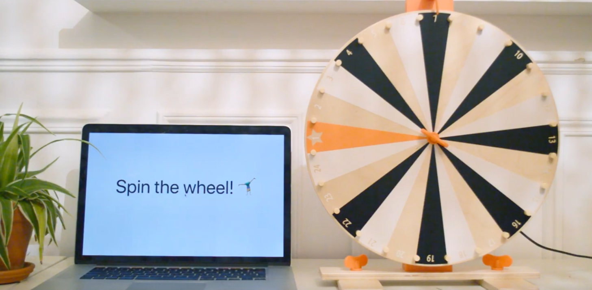
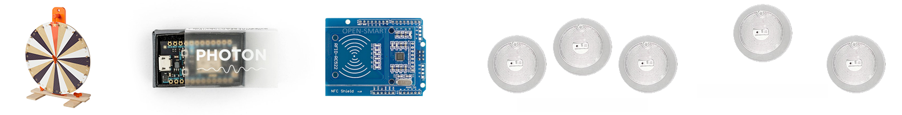
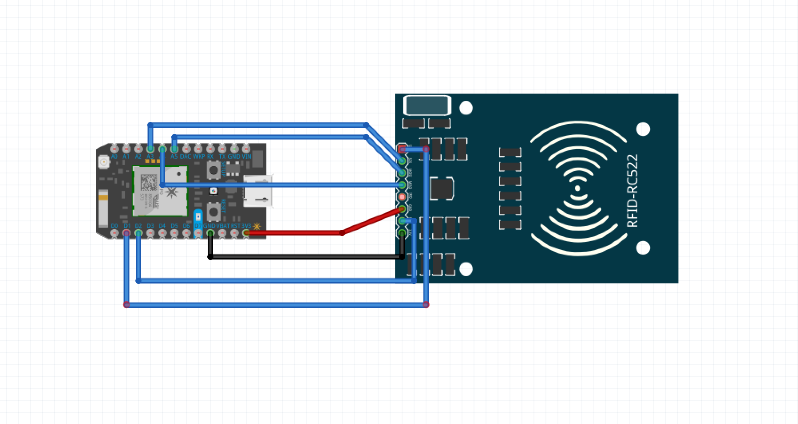
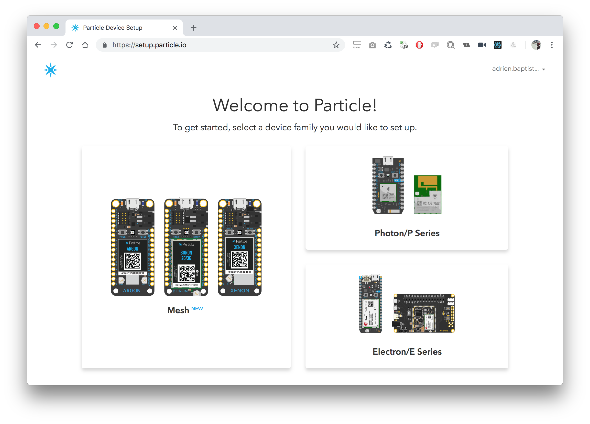
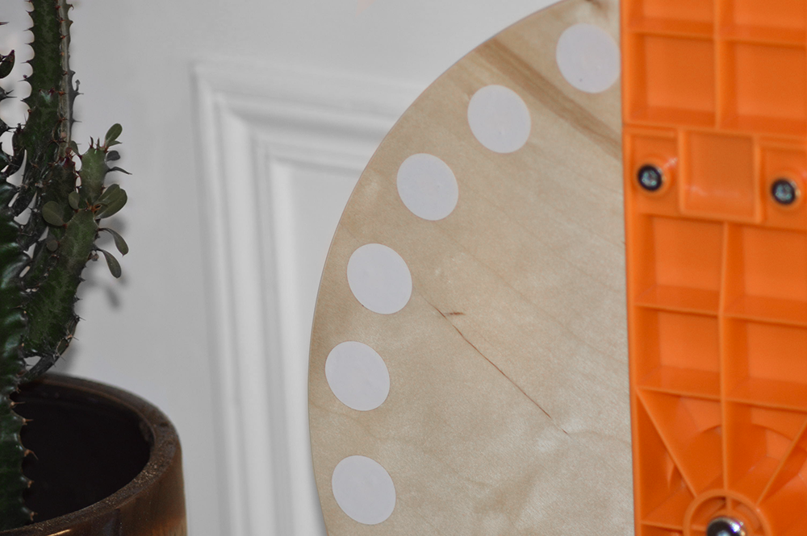
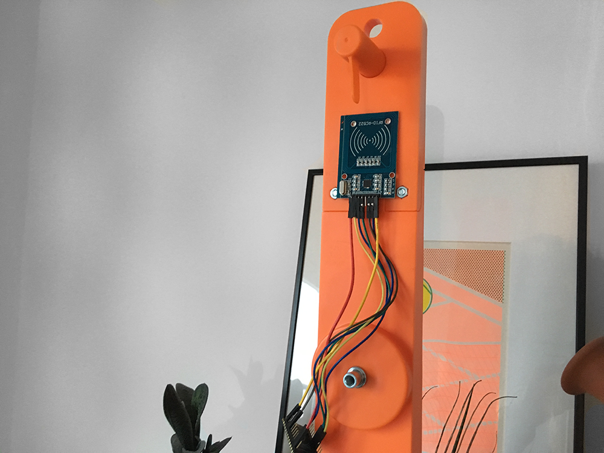
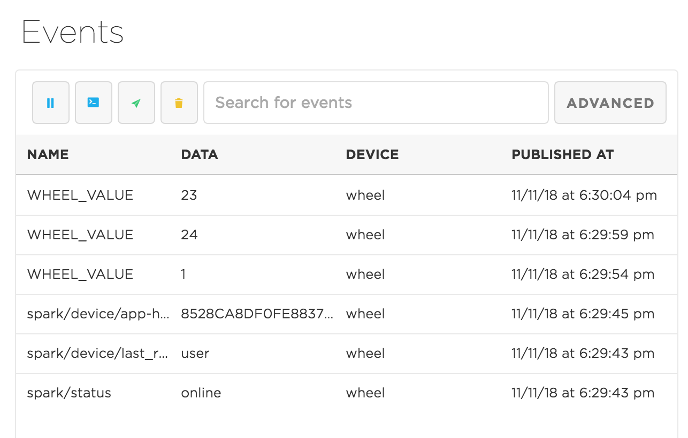
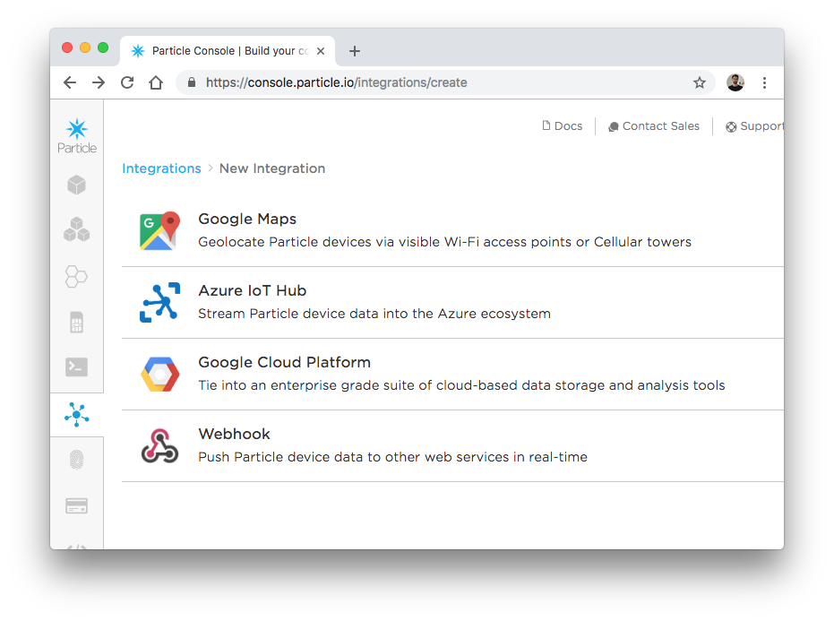
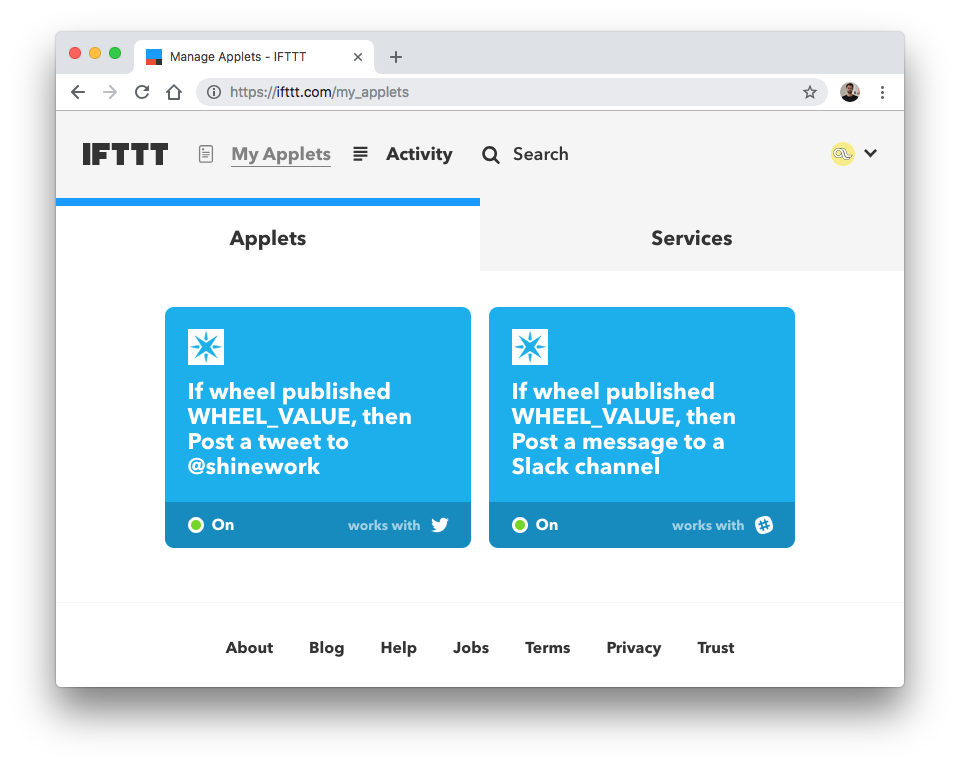
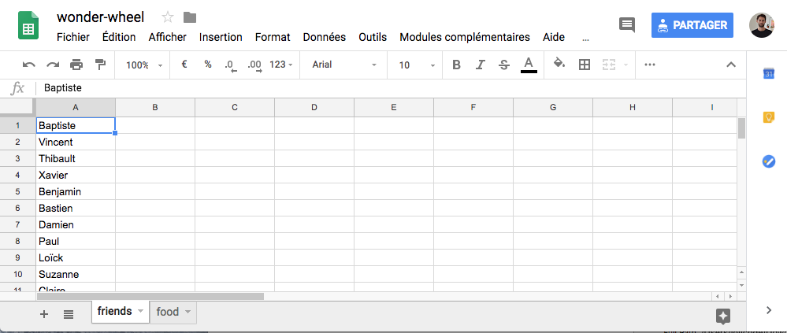

<p align="center">
  
</p>

# Wonder Wheel 🎡

> IKEA LUSTIGT Wheel of Fortune hack with Particle Photon + RFID

### Project

- 📽 [Demo video](https://www.youtube.com/watch?v=hQDlTcZH-zk)
- 📔 [Blog Post (french)](https://www.premieroctet.com/blog/transformez-une-roue-ikea-lustigt-en-une-roue-connectee-wifi/)
- 🎡 [How To (below)](https://github.com/premieroctet/wonder-wheel#parts--materials)
- ⚙️ [Particle code](wheel.ino)
- ⚛️ [React code](/src)



### Getting started

#### Particle code

Particle code is available in the [wheel.ino](wheel.ino) sketch.

## React app

Install and run with

```bash
yarn # Install dependencies
yarn start # Start dev server
yarn build # Build app
```

Edit the `.env` file with your own settings :

```
REACT_APP_DEVICE_ID=XXX
REACT_APP_PARTICLE_TOKEN=XXX
REACT_APP_SHEET_ID=XXX
REACT_APP_GOOGLE_SHEET_TOKEN=XXX
```

## Hardware stack

### RFID

Radio-frequency identification uses electromagnetic fields to automatically identify tags. The tags are passive and contain electronically-stored information (an ID) that are readable by a RFID card. Tags exist under plenty of medium: cards, key rings, but for our case, we'll use stickers, because they are:

- Slim (~1mn)
- Passive (powerless)
- Sticky
- Cheap (~\$20 for 50 stickers)

You get the idea: paste 24 stickers behind each case of the wheel and add the RFID reader on the base. And for sending values to Internet? Particle Photon of course!

### Particle Photon

Since I started to use Particle products, 4 years ago, I've never reused an Arduino again. Because [Particle Photon](https://store.particle.io/products/photon) is Arduino on steroids:

- Embbed WiFi ;
- Same PINs that Arduino ;
- Reachable with a [REST API](https://docs.particle.io/reference/device-cloud/api/) ;
- Web based IDE ;
- Ton of dev tool ;
- Great documentation ;
- Small and affordable (\$19).

I put Particle Photon everywhere. In our case, the RFID reader will be connect to the Wifi connected Photon that will embed our code.

## Parts & Materials

Hold your horses! It's shopping time… As seen above, we'll need:



- 1 x [IKEA Lustigt Wheel of Fortune](https://www.ikea.com/fr/fr/catalog/products/30387038/) (\$20);
- 1 x [Particle Photon with headers](https://store.particle.io/products/photon) (\$19) ;
- 1 x [RC522 card](https://www.amazon.fr/Mifare-Lecteur-Lecture-Antenne-Reader/dp/B06X9PZSQN) (\$5);
- 24 x [RFID sticker tag](https://www.amazon.fr/gp/product/B075R7363J) (\$18 / 50 stickers);.
- 5 x [wires female to female](https://www.amazon.fr/Ganvol-40-câbles-20-dexpérimentation-dordinateur/dp/B01LWAXJJS) (\$5 / 40 wires);.

And also:

- Iron ;
- Double-sided fixing ;
- Power adaptater 5V micro USB.

## Hardware

Don't worry, the assembly is quiet easy: if you have bought the RC522 card, you have to solder the header:


### Wire up cards

Here is the wire up between the RC522 card and the Photon:

```bash
Function     RC522 Pin     Photon Pin
-------------------------------------
Reset        RST           D2
SPI SS       SDA           D1
SPI MOSI     MOSI          A5
SPI MISO     MISO          A4
SPI SCK      SCK           A3
IRQ          IRQ           -
GROUND       GND           GND
POWER        3.3V          3.3V # 🚨 Not 5V!
```



Plug yours female wires throught the headers of both cards. That's all! Your are now ready to set up your Photon.

### Set up your Photon

If you haven't set up your Photon yet, follow the instructions on https://setup.particle.io:



When you are set your WiFi credentials in your Photon and added them to your account you are ready to code!

### Add RFID stickers

Cards are ready! Paste the RFID tags behind each case of your wheel.



### Attach the card

Last step: attach the RC522 card to the wheel with double-sided adhesive tape:



You are done!

## Software

### Read tags UID

Add the library https://github.com/pkourany/MFRC522_RFID_Library to our project, this minimal code should read the UID of each tags:

```js
#include "MFRC522/MFRC522.h"
#define SS_PIN D1
#define RST_PIN D2

MFRC522 mfrc522(SS_PIN, RST_PIN);

void setup() {
  mfrc522.setSPIConfig();
  mfrc522.PCD_Init();
}

void loop() {
  if (!mfrc522.PICC_IsNewCardPresent() && !mfrc522.PICC_ReadCardSerial()) {
    return
  }

  String UID = "";

  for (byte i = 0; i < mfrc522.uid.size; i++) {
    UID += String(mfrc522.uid.uidByte[i] < 0x10 ? "0" : "");
    UID += String(mfrc522.uid.uidByte[i], HEX);
  }

  mfrc522.PICC_HaltA();
  Particle.publish("WHEEL_VALUE", UID, 5, PRIVATE);
}
```

Particle Publish allows you to easily share data with the rest of the world (other devices, apps, websites). You can view events log on the [Event dashboard](https://console.particle.io/events). You should view the `WHEEL_VALUE` event within the list:



From now, you can read all values one by one (boring task alert) and put them in a string array:

```js
String wheelCases[] = {
    "044653120a3c80", // case 1
    "043653120a3c80",
    "04513d92ec5a80",
    "043c4892ec5a81",
    "04374892ec5a81",
    "04454792ec5a81",
    "043f4e92ec5a81",
    "04244e92ec5a81",
    "04414892ec5a81",
    "04294e92ec5a81",
    "042e4e92ec5a81",
    "04354e92ec5a81", // case 12
    "043a4e92ec5a81",
    "04444e92ec5a81",
    "046f4e92ec5a81",
    "044c4c92ec5a81",
    "045f4392ec5a80",
    "04484d92ec5a81",
    "04e64992ec5a80",
    "04514c92ec5a81",
    "04564c92ec5a81",
    "04f04992ec5a80",
    "043e53120a3c80",
    "042d53120a3c80" // case 24
};
```

Great! Our hardware stack works, but our code is no very effective: each time the RFID card reads a value, it publishes a new event. We have to detect when the wheel spins and only publish the last event (ie. debouncing).

### Make our code smarter

Here is the improvement for sending latest value. When, no value has been read since Xms (defines by `debounceDelay`), we publish the value with `Particle.publish()`. We also publish a `SPINNING` event, which will allow us to add feedback in our incoming UI.

```c
#include "MFRC522/MFRC522.h"
#define SS_PIN D1
#define RST_PIN D2

MFRC522 mfrc522(SS_PIN, RST_PIN); // Create MFRC522 instance.

String wheelCases[] = {
   // Add your UIDs mapping here
};

long chrono = 0;
long debounceDelay = 1000;

bool isInit = true;
bool isSpinning = false;

String valueToCommit = "";

void setup() {
  mfrc522.setSPIConfig();
  mfrc522.PCD_Init();
}

void loop() {
    if (mfrc522.PICC_IsNewCardPresent() && mfrc522.PICC_ReadCardSerial()) {
        if (!isSpinning) {
            Particle.publish("SPINNING", "true", 5, PRIVATE);
            isSpinning = true;
        }

        String UID = "";
        String label = "";

        for (byte i = 0; i < mfrc522.uid.size; i++) {
          UID += String(mfrc522.uid.uidByte[i] < 0x10 ? "0" : "");
          UID += String(mfrc522.uid.uidByte[i], HEX);
        }

        mfrc522.PICC_HaltA();

        for (int i=0; i<24; i++){
            if (wheelCases[i] == UID){
                label = i + 1;
            }
        }

        if (!isInit) {
            valueToCommit = label;
            chrono = millis();
        }

        isInit = false;
    }

    if (valueToCommit != "" && (millis() - chrono) > debounceDelay) {
        Particle.publish("WHEEL_VALUE", valueToCommit, 5, PRIVATE);
        Particle.publish("SPINNING", "false", 5, PRIVATE);

        valueToCommit="";
        isSpinning = false;
    }
}
```

## Applications

Stuff is now wrapped! It's time to create some kickass app!

### Hook everything

Thanks to the Particle Web platform, we can easily share our event through webhooks. The [Integrations section](https://console.particle.io/integrations) of the Particle Console allows you to create a new webhook and send value to Slack (thank with a _incoming webhook_):



Good news: Particle has an integration on the [IFTTT](https://ifttt.com) platform. You can basically link your event with all IFTTT services like Slack, Google Doc, Twitter:



### React application

Webhooks are fun, but let's build a React app… Particle exposes a JS Library for the Particle cloud: [particle-api-js](https://github.com/particle-iot/particle-api-js) that makes easy to interact with your Photon.

Bootstrap your new React app with [create-react-app](https://github.com/facebook/create-react-app):

```bash
npx create-react-app wonder-wheel
cd wonder-wheel
yarn start
```

And use the [getEventStream()](https://docs.particle.io/reference/SDKs/javascript/#get-event-stream) method for subscribing to yours events :

```js
import React, { Component } from "react";
import Particle from "particle-api-js";

const DEVICE_ID = "XXXXX";
const TOKEN = "XXXXX";
const particle = new Particle();

class App extends Component {
  state = { isSpinning: false, event: null };

  componentDidMount() {
    particle
      .getEventStream({ deviceId: DEVICE_ID, auth: TOKEN })
      .then(stream => {
        stream.on("event", event => {
          if (event.name === "SPINNING") {
            this.setState({ isSpinning: true });
          } else if (event.name === "WHEEL_VALUE") {
            this.setState({ event: event.data, isSpinning: false });
          }
        });
      });
  }

  render() {
    return (
      <div className="app">
        <div className="caption">
          {this.state.isSpinning ? (
            <span>✨ Spinning ✨️</span>
          ) : (
            <>
              {this.state.event ? (
                <span>🕺 {this.state.event} 🕺</span>
              ) : (
                <span>Spin the wheel! 🤸‍♀️</span>
              )}
            </>
          )}
        </div>
      </div>
    );
  }
}
```

You can use a Google spreadsheets to create a mapping between yours numbers and some labels:



… and link them thanks to the Google Spreadsheet API:

```js
const API_KEY = "xx";
const SPREADSHEET_ID = "xx";
const SHEET_NAME = "food";

loadLabels = async () => {
  const data = await fetch(
    `https://sheets.googleapis.com/v4/spreadsheets/${SPREADSHEET_ID}/values/${SHEET_NAME}!a1:a26?key=${API_KEY}`
  ).then(res => res.json());

  return data.values;
};
```

Checkout the complete code in this repo:

- ⚙️ [Particle code](wheel.ino)
- ⚛️ [React code](/src)

And the video demo:

[](https://www.youtube.com/watch?v=hQDlTcZH-zk)

Happy hacking! 🎈
